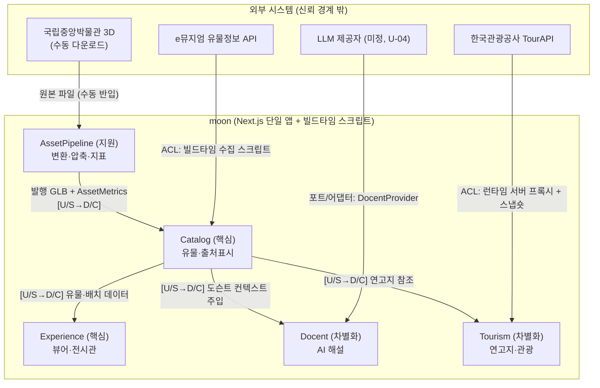

# 03. 도메인 문서 (DDD)

> 작성일: 2026-06-12 · 상태: **채택** · 선행: `02-spec.md` · 후행: `04-plan.md`
> 유비쿼터스 언어와 바운디드 컨텍스트를 정의한다. 코드 식별자·UI 문구·문서는 본 용어집을 따른다(헌법 §5-4).
> 규모(유물 6~8점, 단일 작업자, 14일)에 맞춘 **경량 DDD** — 전략적 설계(컨텍스트 경계) 중심, 전술 패턴은 최소만.

---

## §1. 유비쿼터스 언어 용어집

| 용어 | 영문(코드) | 정의 | 주 컨텍스트 |
|---|---|---|---|
| 유물 | `Artifact` | 서비스에 등록된 문화유산 소장품 단위. 메타데이터 + 3D 에셋 + 출처표시를 가짐 | Catalog |
| 3D 에셋 | `Asset3D` | 유물의 3차원 표현. 원본→변환→발행 단계를 거친 산출물과 그 지표 | AssetPipeline |
| 에셋 지표 | `AssetMetrics` | 에셋의 정량 기록: 원본/발행 용량, 폴리곤 수, 절감률 (B1·B4 증빙) | AssetPipeline |
| 출처표시 | `Attribution` | 공공누리 유형 + 제공기관 + 원천 URL. 유물 필수 구성요소 (헌법 §1) | Catalog |
| 공공누리 | `KOGL` | 공공저작물 자유이용허락 표시제도 (1~4유형, 본 서비스는 1유형 위주) | Catalog |
| 소장처 | `Museum` | 유물을 소장한 기관 (예: 국립중앙박물관) | Catalog |
| 시대 | `Era` | 유물 제작 시기 분류 (신석기·청동기·초기철기·낙랑·삼국시대·신라·통일신라·고려·조선). 연대순 정렬 기준은 `taxonomy.ERA_ORDER` | Catalog |
| 분류 | `Category` | 유물 특징에 따른 갈래 (토기·도기 / 청동기 / 금속공예·장신구 / 불교조각 / 도자기). 카탈로그 필터·전시관 구역의 기준. `taxonomy.CATEGORY_ORDER` | Catalog |
| 재질 | `Material` | 유물 재질 분류 (금속·토제·도자기·석·목·지류 등) | Catalog |
| 연고지 | `HeritageSite` | 유물과 지리적 연고가 있는 장소 (출토지·원소재지·소장처 위치) + 좌표 | Tourism |
| 관광정보 | `TourismInfo` | 연고지 주변 관광지·시설 정보 (TourAPI 유래) | Tourism |
| 가상 전시관 | `Exhibition` | 유물을 3D 공간에 배치한 가상 공간. 키보드 1인칭 보행으로 관람 | Experience |
| 전시 구역 | `ExhibitionZone` | 한 분류(`Category`)의 유물이 모인 전시실 구역. 표지·바닥 음영으로 구분 | Experience |
| 전시 배치 | `Placement` | 전시관 내 유물의 위치·회전·크기 (구역·분류 체계에서 자동 생성) | Experience |
| 도슨트 세션 | `DocentSession` | 특정 유물 맥락의 대화형 해설 세션 (클라이언트 보관, 서버 무상태) | Docent |
| 해설 | `Narration` | 도슨트가 생성한 설명 텍스트 (스트리밍) | Docent |
| 큐레이션 노트 | `CurationNote` | 빌드타임 AI 생성 + 사람 검수를 거친 감상 포인트 (F8) | Catalog |
| 발행 | `publish` | 파이프라인이 에셋을 웹 서빙 가능한 최종 형태(GLB+포스터)로 내보내는 행위 | AssetPipeline |

명명 규칙: 코드는 영문 PascalCase(타입)·camelCase(변수), UI·문서는 한글 용어를 사용한다. `id`는 사람이 읽을 수 있는 슬러그(예: `gilt-bronze-pensive-bodhisattva`).

## §2. 바운디드 컨텍스트

| 컨텍스트 | 분류 | 책임 | 소유 모델 | 외부 의존 |
|---|---|---|---|---|
| **Catalog** (카탈로그) | 핵심 | 유물 메타데이터의 수집·정제·검증·제공. 출처표시 보장 | `Artifact`, `Attribution`, `CurationNote` | e뮤지엄 API (빌드타임, ACL) |
| **AssetPipeline** (에셋 파이프라인) | 지원 | 원본 3D → GLB 변환·압축·지표 기록·발행. **빌드타임/오프라인 전용** | `Asset3D`, `AssetMetrics` | 박물관 3D 다운로드 (수동) |
| **Experience** (체험) | 핵심 | 3D 뷰어·가상 전시관 렌더링과 인터랙션 | `Exhibition`, `Placement` | Catalog (읽기) |
| **Docent** (도슨트) | 차별화 | 유물 맥락 주입 대화형 해설. AI활용 20% 담당 | `DocentSession`, `Narration` | Catalog (읽기), LLM 제공자 (포트) |
| **Tourism** (관광 연계) | 차별화 | 연고지·주변 관광정보 제공 | `HeritageSite`, `TourismInfo` | Catalog (읽기), TourAPI (런타임, ACL) |

구현 형태: 별도 서비스가 아니라 **Next.js 단일 앱 안의 모듈 경계**(디렉토리)로 구현한다 (`04-plan.md` §9). 공유 커널은 식별자·공통 타입(`ArtifactId` 등) 최소한으로 제한.

## §3. 컨텍스트 맵



표기: `[U/S→D/C]` = Upstream/Supplier → Downstream/Customer. Catalog가 모든 사용자 대면 컨텍스트의 공급자다.

## §4. 핵심 모델 스케치

전술 DDD는 이 수준까지만 적용한다. 확정 스키마(zod)는 `04-plan.md` §4.

```ts
// ── Catalog: Artifact 애그리거트 (루트) ─────────────────
Artifact {
  id: ArtifactId            // slug, 전 컨텍스트 공유 식별자
  title: string             // 명칭 (예: "금동미륵보살반가사유상")
  era: Era; category: Category; material: Material
  dimensions?: string       // "높이 93.5cm" 등 원문 그대로
  description: string       // 정제된 설명 (e뮤지엄 유래 시 출처 식별)
  museum: Museum            // 소장처
  attribution: Attribution  // ★필수 — 없으면 등록 불가 (헌법 §1)
  asset: Asset3D            // 발행된 에셋 참조
  siteId?: HeritageSiteId   // 연고지 (선택)
  curationNotes?: CurationNote[]  // F8, 검수 완료분만
  featured: boolean         // 홈 노출
}

Attribution { kogl: 1|2|3|4, provider: string, sourceUrl: string }

// ── AssetPipeline: Asset3D 값객체 ───────────────────────
Asset3D {
  glbPath: string           // "/models/<id>.glb"
  posterPath: string        // 폴백·썸네일 이미지 (AC-F1-3)
  metrics: AssetMetrics     // 발행 시 자동 기록
}
AssetMetrics {
  sourceFormat: "PLY"|"OBJ"|"GLB", sourceSizeMB: number
  publishedSizeMB: number   // B1: ≤5MB 목표/8MB 상한
  reductionPct: number      // B4: ≥90% 목표
  triangles: number, pipelineVersion: string, processedAt: string
}

// ── Tourism ────────────────────────────────────────────
HeritageSite {
  id: HeritageSiteId, name: string
  relation: "출토지"|"원소재지"|"소장처"
  coords: { lat: number, lng: number }
}
// TourismInfo는 TourAPI 응답을 ACL로 변환한 읽기 모델 (저장하지 않음, 캐시만)

// ── Experience: Exhibition 애그리거트 ───────────────────
// placements·zones는 저장소(등록·발행 유물) + 분류 체계(taxonomy)에서 파생 생성된다.
Exhibition {
  id: string, title: string, theme: string   // content/exhibitions.json은 메타만 보관
  zones: ExhibitionZone[]    // 분류별 구역 (AC-F6-1·F6-4)
  placements: Placement[]    // ≥4, 전 구역 평탄화 (AC-F6-1)
  bounds, spawn, hallLength   // 1인칭 보행 경계·시작점·복도 길이
}
ExhibitionZone { category: Category, count: number, signPosition: Vec3, startZ, endZ }
Placement { artifactId, category, position: Vec3, rotationY: number, scale: number }

// ── Docent (서버 무상태) ────────────────────────────────
DocentSession {              // 클라이언트가 보관, 요청마다 전체 전달
  artifactId: ArtifactId
  messages: { role: "user"|"docent", content: string }[]  // 상한: AC-F4-4
}
```

**불변 규칙 (도메인 제약)**
1. `Artifact.attribution` 없이는 어떤 경로로도 유물을 노출할 수 없다.
2. `Asset3D`는 파이프라인 `publish` 단계를 통해서만 생성된다 — 수동으로 GLB를 끼워넣지 않는다(지표 누락 방지).
3. `metrics.publishedSizeMB > 8`(B1 상한)이면 `publish`가 실패해야 한다.
4. `Placement.artifactId`는 등록된 유물만 참조한다.

## §5. 통합 규칙 — 부패 방지 계층(ACL)

1. **외부 API 응답 타입을 컨텍스트 내부로 들이지 않는다.** e뮤지엄·TourAPI 응답은 경계에서 내부 모델로 변환하고, 변환기는 한 곳에만 둔다.
2. e뮤지엄: **빌드타임 수집** — 스크립트가 API 호출 → 정제 → 유물 JSON에 병합(출처 필드 포함). 런타임 의존 없음 → API 장애가 서비스에 전파되지 않는다.
3. TourAPI: **런타임 프록시** — 서버 라우트에서 호출·캐시(1h), 실패 시 리포지토리 내 스냅숏 폴백(수집 시각 표기, AC-F5-3).
4. LLM: `DocentProvider` **포트** 뒤에 격리. 어댑터(anthropic/gemini/mock) 교체가 1파일 추가로 끝나야 한다 (헌법 §6-3).
5. API 키는 전부 서버 전용 — 신뢰 경계(§3 그림) 밖으로 나가는 호출은 서버에서만.

## §6. 설계 절제 노트 (의도된 비채택)

| 비채택 | 이유 |
|---|---|
| 도메인 이벤트 버스, CQRS | 단일 앱·정적 콘텐츠 규모에 과설계. "이벤트"는 파이프라인의 지표 파일 기록으로 충분 |
| 컨텍스트별 패키지 분리(모노레포) | 디렉토리 경계로 충분, 14일 일정 |
| Docent 서버 상태(세션 저장) | 클라이언트 보관 + 무상태 API가 단순·저비용. 상한 강제는 요청 검증으로 |
| 범용 CMS·어드민 | 유물 등록은 JSON 파일 + zod 검증으로 충분 |

확장 시점(유물 100점+, 다국어)의 전환 경로는 `04-plan.md` §3에 기록한다 — 컨텍스트 경계가 그대로 모듈→서비스 분리선이 된다 (발전가능성 20% 대응).
