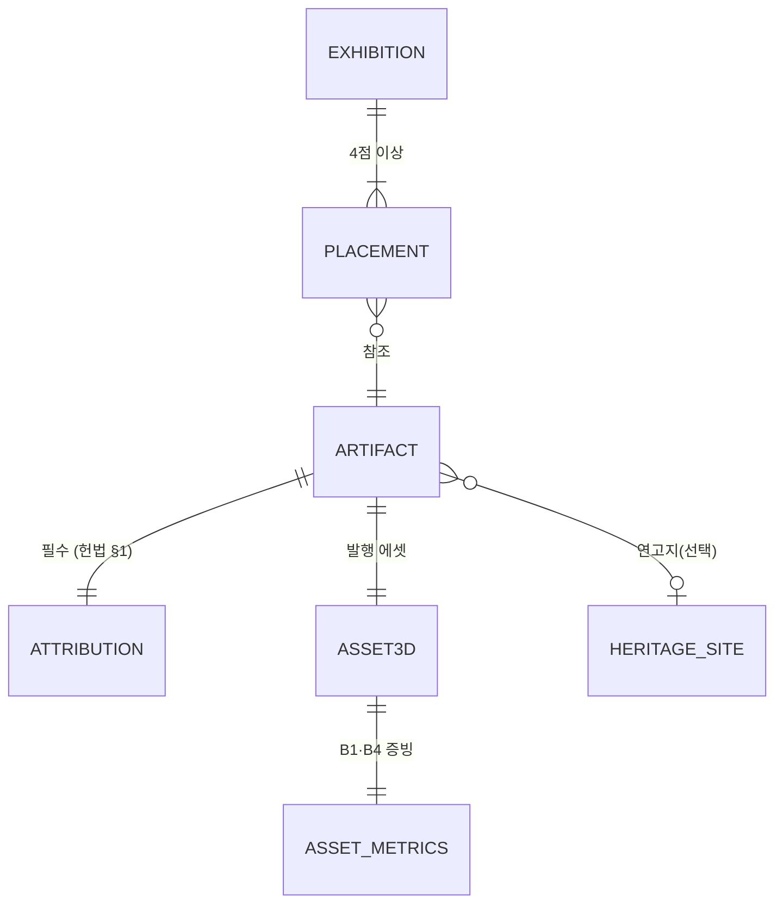

# 04. 기술 계획 (Plan) — HOW

> 작성일: 2026-06-12 · 상태: **채택** · 선행: `02-spec.md` `03-domain.md` · 후행: `05-tasks.md`
> `02`의 요구사항을 충족하는 구현 방법을 확정한다. 스택은 헌법 §6에 고정: **Next.js(App Router) + TS(strict) + R3F + Tailwind, Vercel**.

---

## §1. 아키텍처 개요

```mermaid
graph TB
  subgraph CLIENT["브라우저"]
    VIEWER["R3F 유물 뷰어 (F1)"]
    EXH["가상 전시관 (F6)"]
    CHAT["도슨트 채팅 UI (F4)"]
    MAP["연고지 지도 (F5)"]
  end

  subgraph VERCEL["Vercel — Next.js App Router"]
    PAGES["SSG 페이지<br/>홈·카탈로그·유물 상세·전시관·about"]
    API_DOC["POST /api/docent<br/>스트리밍 + 레이트리밋"]
    API_TOUR["GET /api/tourism<br/>TourAPI 프록시 + 캐시 1h"]
    CDN["정적 에셋 CDN<br/>public/models/*.glb"]
  end

  subgraph BUILD["빌드타임 / 오프라인"]
    CONTENT["콘텐츠 모듈<br/>content/artifacts/*.json (zod 검증)"]
    PIPE["에셋 파이프라인 스크립트<br/>변환→압축→지표→발행"]
    COLLECT["e뮤지엄 수집 스크립트"]
  end

  EXT_LLM["LLM 제공자 (미정)"]
  EXT_TOUR["TourAPI"]
  EXT_EMU["e뮤지엄 API"]
  EXT_M3D["박물관 3D 원본"]

  CLIENT --> PAGES
  VIEWER & EXH --> CDN
  CHAT --> API_DOC --> EXT_LLM
  MAP --> API_TOUR --> EXT_TOUR
  CONTENT --> PAGES
  EXT_M3D -.수동 반입.-> PIPE -.GLB+지표.-> CDN
  PIPE -.metrics.json.-> CONTENT
  EXT_EMU -.빌드 전 수집.-> COLLECT -.병합.-> CONTENT
```

핵심 선택: **유물 페이지는 전부 SSG**(데이터가 빌드타임 확정) + **동적 기능 2개만 API 라우트**(도슨트·관광). 3D는 CDN 정적 서빙. 런타임 장애 지점을 2개로 최소화.

## §2. 스택 확정

버전은 스캐폴딩 시점(6/13) 최신 안정으로 고정하고 lockfile 커밋. 추가 의존성은 이 표에 근거 한 줄 추가(헌법 §6-4).

| 영역 | 선택 | 근거 |
|---|---|---|
| 프레임워크 | Next.js (App Router) + TypeScript strict | SSG+API 라우트 단일 앱, Vercel 무설정 배포 |
| 3D | three + @react-three/fiber + @react-three/drei | drei의 `useGLTF`(+Draco/meshopt/KTX2 로더), `OrbitControls`, `Stage` 등 뷰어 부품 즉시 사용 |
| 스타일 | Tailwind CSS | 속도. 디자인 시스템 불요 |
| 스키마 검증 | zod | 콘텐츠 JSON 빌드타임 검증 — 헌법 §1 필수 필드 강제 |
| 지도 | Leaflet + react-leaflet + OSM 타일 | **API 키 불필요**(U-06 리스크 제거). Kakao 지도는 키·도메인 등록 필요 → 시간 남으면 교체 검토 |
| 상태 | React 내장 (필요 시 zustand) | 전역 상태가 거의 없음. 선제 도입 금지 |
| 파이프라인 | obj2gltf + @gltf-transform/cli (Blender headless는 폴백) | 원본이 OBJ+MTL+텍스처로 확정(2026-06-12) → obj2gltf로 충분, 압축·최적화는 gltf-transform |
| 배포 | Vercel (Hobby) | git push 배포, CDN 포함, 비용 0 |

## §3. 데이터 전략 — DB 미도입 (헌법 §6-2)

- 유물 6~8점·읽기 전용·빌드타임 확정 → **`content/artifacts/*.json` 파일이 데이터베이스다.** git이 이력 관리, zod가 무결성 검증(빌드 실패로 강제), Vercel 빌드가 "마이그레이션".
- 접근은 **저장소 패턴**으로 추상화: `ArtifactRepository`(`getAll/getById/search`) 인터페이스 + `JsonArtifactRepository` 구현. UI·도슨트·관광 코드는 인터페이스에만 의존.
- **확장 경로(발전가능성 20% 대응, 기획서 인용용)**: 유물 100점+ 시 `JsonArtifactRepository` → `PostgresArtifactRepository`(Supabase 등) 교체만으로 전환. 컨텍스트 경계(`03` §2)가 서비스 분리선.
- e뮤지엄 메타: **빌드 전 수집 스크립트**(`scripts/collect-emuseum.mjs`)가 호출·정제 후 JSON에 `sources` 필드와 함께 병합 — 런타임 무의존(`03` §5-2), 데이터활용 증빙은 수집 스크립트+출처 필드로. 실호출 검증(2026-06-12): keyword 필터 미지원(총 334,187건) → 페이지네이션 1회 수집해 로컬 캐시 후 유물 명칭 매칭.

## §4. 데이터 모델

`03-domain.md` §4 모델의 구현 형태. zod 스키마가 단일 진실원이고 TS 타입은 `z.infer`로 유도.



파일 배치: `content/artifacts/<id>.json`(유물 1점 1파일) · `content/sites.json` · `content/exhibitions.json` · `content/metrics.json`(파이프라인 자동 생성 — 수동 편집 금지).

## §5. 라우트 맵

| 라우트 | 렌더링 | 기능 |
|---|---|---|
| `/` | SSG | 홈: 히어로 + 추천 유물(featured) |
| `/artifacts` | SSG + 클라 필터 | F2 카탈로그 (검색·필터는 클라이언트, 6~8점이라 충분) |
| `/artifacts/[id]` | SSG (`generateStaticParams`) | F1 뷰어 + F3 상세 + F4 도슨트 + F5 지도 |
| `/exhibition` | SSG (3D는 클라) | F6 가상 전시관 |
| `/about` | SSG | 프로젝트 소개 + **전체 데이터 출처 일람**(헌법 §1-2) + 지표 요약 |
| `/embed/[id]` | SSG | F7 뷰어 단독 (P3) |

## §6. API 명세 (런타임 2개만)

| 메서드·경로 | 요청 | 응답 | 정책 |
|---|---|---|---|
| `POST /api/docent` | `{ artifactId, messages[] }` (zod 검증, messages ≤ 20) | 평문 텍스트 청크 스트림 (`text/plain`, 구현 2026-06-13) | IP 레이트리밋(분당 5), maxTokens 상한, 키 미설정 시 mock (AC-F4-4) |
| `GET /api/tourism?siteId=` | siteId | `TourismInfo[]` (내부 모델, ACL 통과분) | `revalidate: 3600` 캐시, 실패 시 `content/tourism-snapshot.json` 폴백 + `snapshotAt` 표기 (AC-F5-3) |

유물 목록/단건은 API로 제공하지 않는다 — SSG에 빌드타임 주입(외부 공개 API는 범위 외).

업스트림 엔드포인트 (실호출 검증 2026-06-12):
- TourAPI: `https://apis.data.go.kr/B551011/KorService2/locationBasedList2` (`_type=json`, `MobileOS=ETC`, `MobileApp=moon`, `mapX/mapY/radius`)
- e뮤지엄: `https://api.kcisa.kr/openapi/service/rest/meta/MPKreli` (XML 응답 — title·temporal·medium·extent·spatial·description·rights)

## §7. 3D 에셋 파이프라인 (`scripts/pipeline/`)

> 원본 포맷 확정(2026-06-12, U-03 14점 실측 — ⚠️ 해소): zip당 32~136MB, 구조 `디지털콘텐츠_OBJ/`(OBJ+MTL+디퓨즈 JPG+노멀맵 JPG) · `스캔_PLY/` · `프린트_STL/`. **신형 패키지(2024-10 이후 제작분)는 OBJ 일습이 `디지털콘텐츠_OBJ/` 안의 중첩 zip**으로 들어 있음 — reception 단계에서 추출. 메시는 약 3만 폴리곤으로 사전 데시메이션되어 있고 **용량 대부분이 텍스처(JPG 2장, 합 30~40MB)** → 압축은 텍스처(KTX2·리사이즈)가 관건, B1(≤5MB)·B4(≥90%) 달성 현실적.

| 단계 | 도구 | 입력 → 출력 | 비고 |
|---|---|---|---|
| 1 reception | 수동 + 스크립트 | 다운로드 zip → `assets/source/<id>/` (중첩 zip이면 OBJ 일습 추출) | 원본은 git 제외(.gitignore), 출처·KOGL은 `SOURCE.md` 동봉(14점 작성 완료) |
| 2 convert | obj2gltf (우선) / Blender headless (폴백) | OBJ+MTL+텍스처 → `assets/work/<id>/converted.glb` | 실측 반영(2026-06-12): MTL의 깨진 제작 PC 경로 정정, `norm` 노멀맵 수동 부착, Z-up→Y-up 회전 보정(`--no-zup`로 예외 처리) |
| 3 optimize | gltf-transform | dedup·prune·weld → **draco** → 텍스처 리사이즈(≤2048) + **WebP(EXT_texture_webp)** | B1 초과 시: `--texsize 1024` → 그래도 초과면 등록 보류 |
| 4 measure | gltf-transform inspect + 스크립트 | 단계별 용량·폴리곤 → `content/metrics.json` 누적 | B1(≤5MB)·B4(≥90%) 검증, **상한 8MB 초과 시 실패 처리**(도메인 불변 규칙 3) |
| 5 publish | 스크립트 | `public/models/<id>.glb` + 포스터 PNG(뷰어 스크린샷) | 포스터는 AC-F1-3 폴백 겸 OG 이미지 |

- 실행: `npm run pipeline -- <id>` 한 줄로 2~5 일괄.
- **M1 게이트(6/14)**: 유물 1점이 전 단계 통과 + 로컬 뷰어에서 B2a(3초) 충족.
- 텍스처는 **WebP 채택**(2026-06-12 결정): KTX2 대비 도구체인 단순(toktx 불필요)·three 기본 지원, 반가사유상 실측 1.3MB로 충분. GPU 메모리가 문제 되면 KTX2 후속 검토.
- **데이터 품질 보정 내역(14점 실측으로 일반화, 2026-06-13)** — 전부 파이프라인이 자동 처리:
  ① MTL 깨진 제작 PC 절대경로·CRLF·비ASCII 재질명(latin1 보존+`material0` 통일)·파일명 오타(접미사 매칭) 정정
  ② 텍스처 사전 정규화: 손상 JPG 마커 재인코딩 + texsize 선리사이즈(obj2gltf 메모리 가드 회피)
  ③ **스케일 정규화**: 원본 단위 혼재(mm/cm) → 경계구 반지름 1유닛 통일(뷰어·전시관 배치 단위 독립)
  ④ 축 보정: 기본 Z-up→Y-up(-90°X), 예외 유물은 `content/pipeline-overrides.json`으로 영구화(`--no-zup` 3점, `--roty` 1점 — 14점 전점 포스터 시각 QA 완료)
- 포스터: `scripts/poster.mjs` — `/embed/<id>`를 헤드리스 Chrome(SwiftShader)으로 렌더해 캡처. AC-F1-3 폴백·썸네일·OG 원천이자 **렌더링 E2E 검증** 수단.
- 폴백 계획: Draco 디코더 문제 시 meshopt로 대체, WebP 문제 시 JPG 텍스처 유지(B1 내라면 허용).
- **첫 실측(2026-06-12, 반가사유상)**: 원본 62.9MB → 발행 1.3MB, **절감 97.9%**, 267,560 tris — B1(≤5MB)·B4(≥90%) 충족.

## §8. AI 도슨트 설계 (F4 — P1)

```ts
// src/docent/provider.ts — 포트 (03 §5-4)
interface DocentProvider {
  stream(req: {
    artifact: ArtifactContext;      // 메타데이터+출처 — 시스템 프롬프트에 주입
    messages: ChatMessage[];        // ≤10 (서버 검증)
  }): ReadableStream<string>;
}
```

- 구현체: `providers/mock.ts`(기본 — 사전 작성 해설 시퀀스, 키 없이 UI 개발), `providers/anthropic.ts` | `providers/gemini.ts` 중 **U-04 결정분 1개**(6/19 T-14에서 연결). 선택은 env `DOCENT_PROVIDER`.
- 시스템 프롬프트 원칙: 주입된 유물 메타데이터 안에서만 답변, 불확실하면 "자료에 없는 내용"이라 답하기, 한국어 존댓말, 응답 ≤300자 권장(읽기 흐름·토큰 비용), 출처(소장처·KOGL) 인지.
- 비용·남용 가드: 인메모리 IP 레이트리밋(분당 5 — 서버리스 인스턴스별 best-effort 한계는 인지하되 공모전 규모에 충분) + 클라이언트 세션 상한(유물당 10문답) + maxTokens 상한.
- UI: 추천 질문 칩(유물 JSON의 `suggestedQuestions` 필드, AC-F4-2), 스트리밍 타자 표시, "AI 생성" 고지(AC-F4-3).

## §9. 디렉토리 구조

```
moon/
├── 00~06 SDD 문서.md
├── assets/                  # 파이프라인 원본·중간물 — git 제외
│   ├── source/<id>/
│   └── work/
└── web/                     # Next.js 앱 (이 안에서 npm 실행)
    ├── app/                 # 라우트 (§5)
    │   ├── artifacts/[id]/
    │   ├── exhibition/  ├── about/  ├── embed/[id]/
    │   └── api/  ├── docent/route.ts  └── tourism/route.ts
    ├── src/
    │   ├── catalog/         # ← 바운디드 컨텍스트 = 디렉토리 (03 §2)
    │   │   ├── schema.ts    # zod — 단일 진실원
    │   │   └── repository.ts
    │   ├── experience/      # Viewer.tsx, ExhibitionRoom.tsx
    │   ├── docent/          # provider.ts, providers/, prompt.ts
    │   ├── tourism/         # acl.ts(TourAPI 변환), Map.tsx
    │   └── shared/          # ArtifactId 등 공유 커널 (최소)
    ├── content/             # artifacts/*.json, sites.json, exhibitions.json, metrics.json
    ├── public/models/       # 발행 GLB + 포스터
    └── scripts/             # pipeline/, collect-emuseum.mjs
```

## §10. 배포 · 환경변수

- Vercel 프로젝트 ← GitHub 저장소 연결(git init + GitHub 푸시는 T-02에 포함). `main` 푸시 = 프로덕션 배포 (헌법 §2-2).
- 환경변수 (전부 서버 전용, `NEXT_PUBLIC_` 금지):

| 변수 | 용도 | 상태 |
|---|---|---|
| `TOUR_API_KEY` | TourAPI 프록시 (코드용 디코딩 키 · URL 직삽입용 `TOUR_API_KEY_ENC` 별도) | ✅ 발급·실호출 검증 2026-06-12 — 루트 `.env.local` |
| `EMUSEUM_API_KEY` | e뮤지엄 수집(빌드 전 로컬 실행) | ✅ 발급·실호출 검증 2026-06-12 — 루트 `.env.local` |
| `DOCENT_PROVIDER` | `mock` \| `anthropic` \| `gemini` | 기본 `mock` |
| `DOCENT_API_KEY` | 선택된 제공자 키 | U-04 결정 후 |

## §11. 성능 측정 계획 → `06-metrics.md` (6/22 M4)

| 예산 | 측정 방법 | 산출물 |
|---|---|---|
| B1·B4 | 파이프라인 4단계 자동 기록 (`content/metrics.json`) | 유물별 원본→발행 용량·절감률 표 |
| B2a/B2b | Chrome DevTools 네트워크 스로틀(없음/Fast 4G), 상세 진입→OrbitControls 응답까지 3회 중앙값 | 유물별 로딩 표 + 스크린샷 |
| B3 | Lighthouse(모바일) — 홈·카탈로그·상세 각 3회 중앙값 | 점수 표 + 리포트 캡처 |

자동화(CI 측정)는 하지 않는다 — 수동 3회 중앙값 + 캡처로 충분(절제). 측정값은 기획서 "정량 성과" 섹션에 그대로 인용.

## §12. 리스크 및 완화

| 리스크 | 영향 | 완화 |
|---|---|---|
| TourAPI·e뮤지엄 활용신청 승인 지연 | F5, F3 메타 | **오늘(6/12) 신청**(U-02). 승인 전: e뮤지엄은 공개 페이지 참조로 수동 정제, TourAPI는 스냅숏 폴백 구조를 먼저 구현 |
| 3D 원본 품질·용량 편차 | 파이프라인 일정 | 후보 10~15점 다운로드 → 잘 압축되는 6~8점 선별 (큐레이션이 곧 품질 관리) |
| 국가유산청 데이터 라이선스 불명 | F6 배경 | 확인 전 미사용(헌법 §1-3). 전시관 배경은 절차 생성(단순 룸)으로 대체 가능 |
| Draco/KTX2 디코더 호환 | F1 | §7 폴백: meshopt·JPG 경로 확보 |
| LLM 결정 지연 (U-04) | F4 = P1 | mock으로 UI 선개발. **6/17까지 미결정 시 비용 0인 Gemini 무료 티어로 자동 확정**(컷 라인 §4-3 연동) |
| 마감 주 Vercel/외부 장애 | 제출 증빙 | 6/22 시연 영상·스크린샷 선확보(M4), 6/25 제출로 버퍼 1일 |
